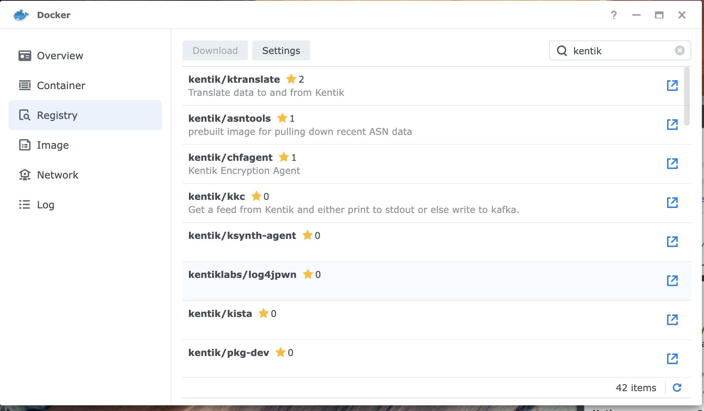
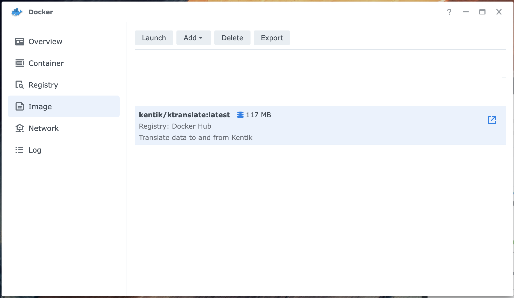
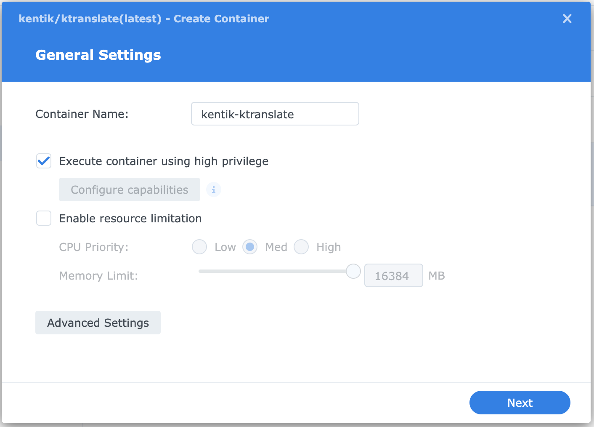
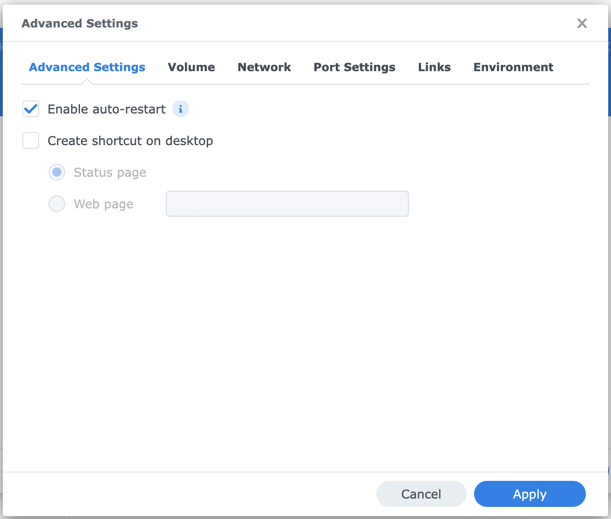
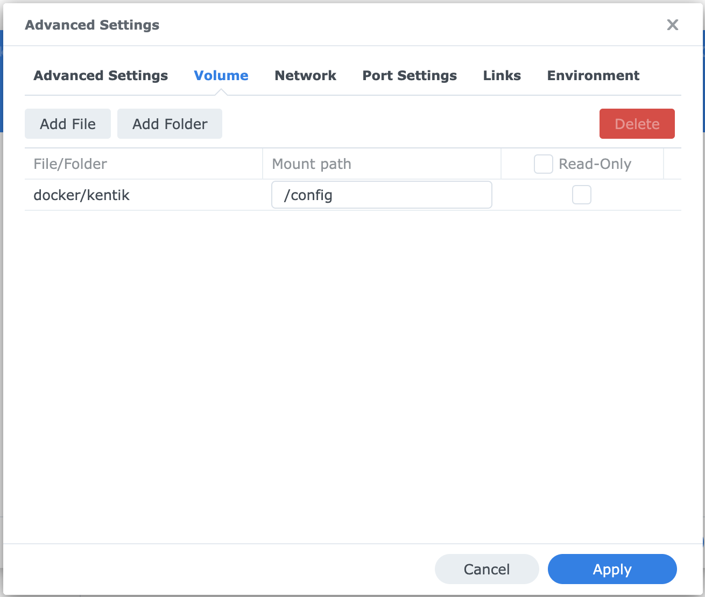
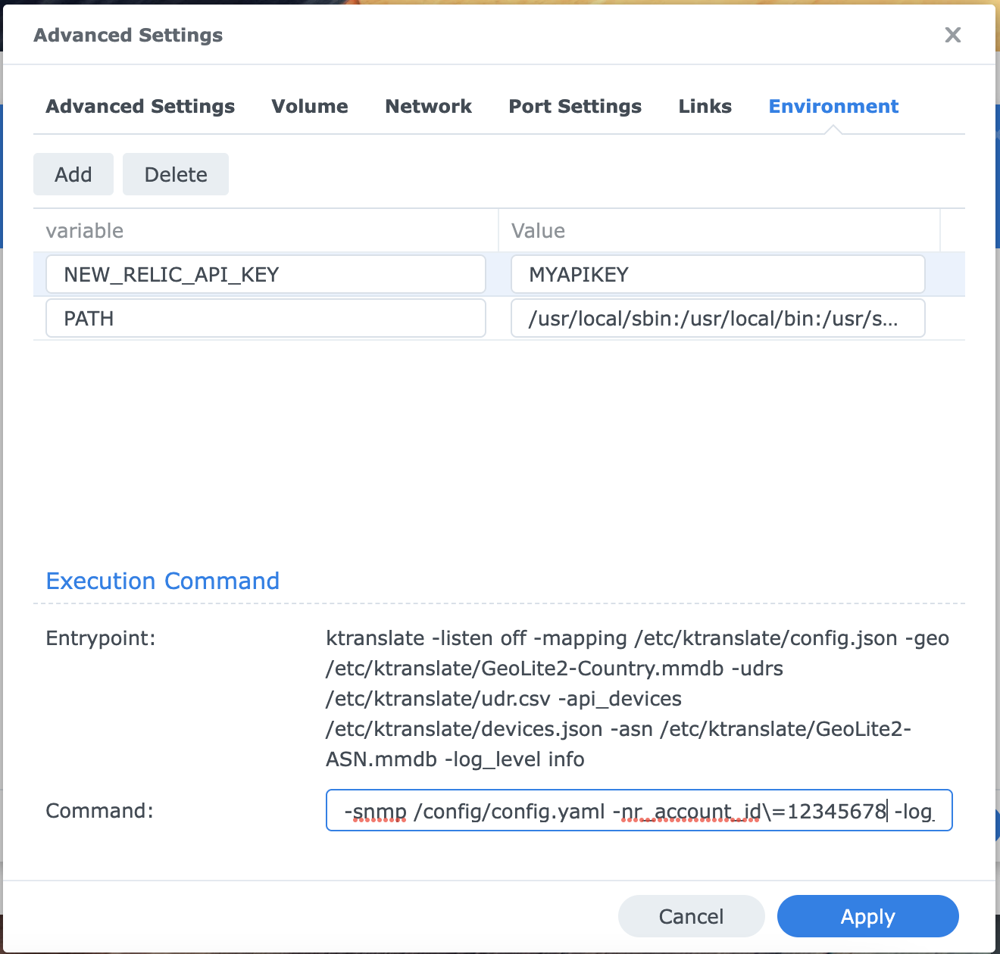
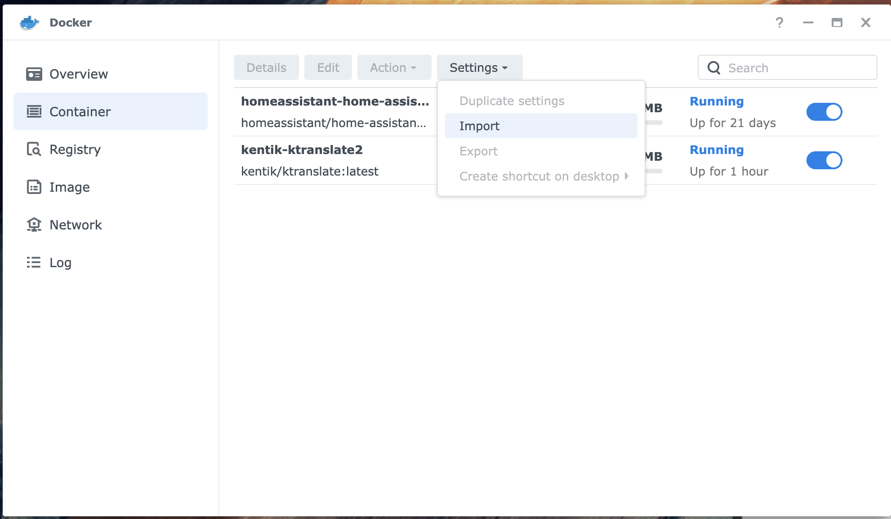

# Synology Docker Configuration for New Relic NPM
A couple different ways of to setup ktranslate on Synology Docker.

### From UI 
---
1. Open the Docker App in Synology, click on **Registry** and search for "kentik". Select kentik/ktranslate and download the latest version.      


2. Click on **Image**, select the kentik/ktranslate:latest image and click Launch.   
  

3. Name the container and select "Execute container using high privilege", then click "Advanced Settings"   


4. Select "Enable auto-restart", then click the Volume tab   
 

5. Add a mount folder, this will be a folder on the nas that will contain the kentik configuration file and set the mount point to "/config", then click the Environment tab.   
 

6. Add the ```NEW_RELIC_API_KEY``` environment variable and set it to your New Relic API Key, then modify the following command arguments with your New Relic Account ID. Leave the escaped "\\=" and paste it in the "Command:" section.   
```
-snmp /config/config.yaml -nr_account_id\=YOUR_ACCOUNT_ID -log_level\=info -metrics\=jchf -tee_logs\=true -service_name\=snmp -snmp_discovery_min\=60 -snmp_discovery_on_start\=true nr1.snmp
```
   

7. Click apply and that should be it.


### From Config Import
---
1. Make a copy of the ```synology_kentik.json``` file in this repo.
2. Update the following sections in the file.   
(Line 4) ```YOUR_ACCOUNT_ID``` Replace this with your New Relic Account ID.   
(Line 17) ```YOUR_API_KEY``` Replace this with your New Relic API Key.   
**Optional** (Line 21) Replace the value of id with the latest image id hash
3. Import your modified file under **Container** in Synology.
